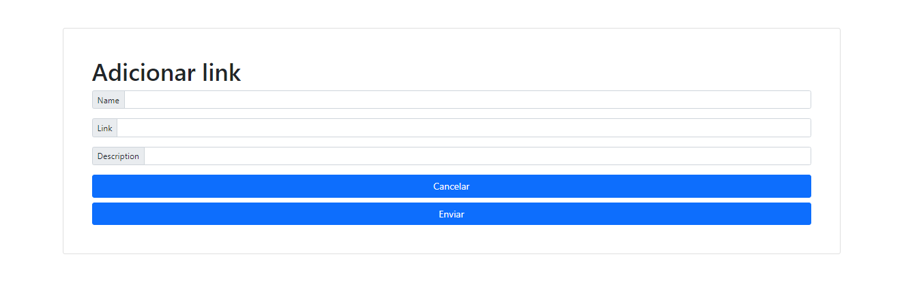
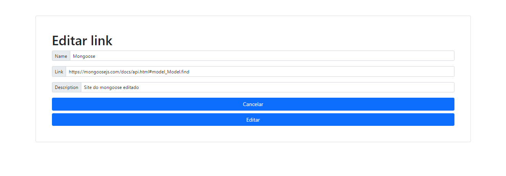

# Projeto de aula 📚

Projeto feito durante a realização do curso fullStack ProgramadorBr!

## **Breve descrição**

O projeto consiste em um CRUD que redireciona o usuário para o link cadastrado no banco de dados, alem de todas as ações do CRUD ele conta as vezes que o usuário foi redirecionado para o link!

## Fotinhos 📸

### Tela de visualisar links

### Tela de adicionar links

### Tela de editadr links

## Foco nas tecnologias 🔍

-   JavaScript

---

-   Node
-   Express
-   Nodemoon
-   Mongoose
-   Ejs

---

-   Git / Github
-   MongoDB
-   Bootstrap

## Objetido do projeto 🎯

O principal objetivo é compreender o funcionamento do banco de dados mongo, também aperfeiçoar o entendimento das rotas com express e os templates ejs!!

## Pré requisitos para rodar na sua maquina ⚓

1. Ter instalado o _MongoDB_ - [Saber mais](https://www.mongodb.com)
2. Ter instalado o _Node_ - [Saber mais](https://nodejs.org/en/)

## Como rodar 🚀

1. Clone o projeto na sua máquina
2. Abra o terminal e digite: `node app.js`
3. Abra o navegador e digite na url (_Ou clique aqui =>_): http://localhost:3232/
